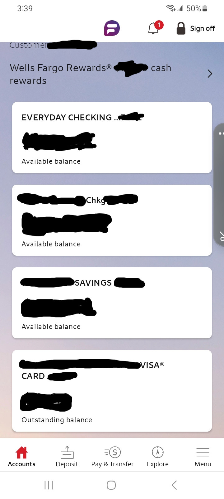
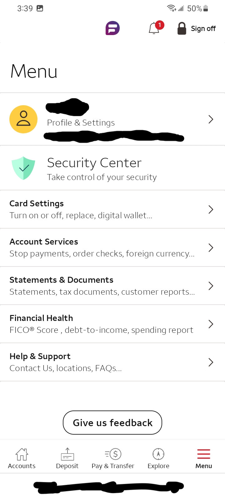

# My experience with wells fargo mobile 
Yizhak Cohen - 12/2/23

I frequently use the Wells Fargo mobile app to check my bank statements, transfer money, check my balance, or receive direct deposits. It has always been convenient for me as I can find my information on the go, and I do not need to travel to the bank to find my routing number, for example. 

The design is simple as the first page after logging in is the Accounts page which lists all the accounts I have and you can click on any of the accounts to view specific details regarding that account. 

